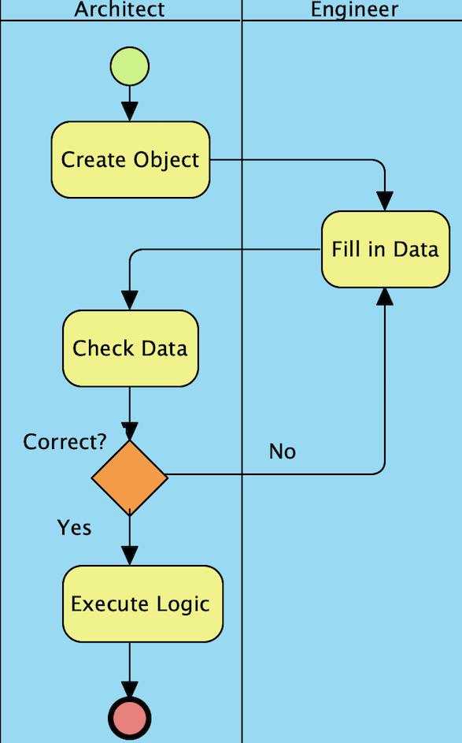

# Example Workflow in Solidity
This repository contains an [Ethereum](https://www.ethereum.org/) DApp.

## Overview
The example workflow illustrates the functionality of the smartcontract `ExampleWorkflow.sol`.

<br class=”blank” />

<br class=”blank” />

Each of the boxes illustrate funtions that can be only called by the respective role. `ArchitectRole.sol` and `EngineerRole.sol` define these roles.

What you should learn with this example:
- How to deal with roles based on the templates from OpenZeppelin.
- How to create a workflow that only allows certain roles an action.
- One example to create a front-end to interact with and test your smart contracts.

## Getting started
### Test on local Ganache network
Install all requisite npm packages (see file `package.json`):
```
npm install
```
Launch Ganache GUI or Ganche-Cli:

Open a separate terminal window (still in the project directory). Compile and migrate the smart contracts:
```
truffle compile
truffle migrate --reset --network development
```
Test the smart contracts (see file `TestExampleWorkflow.js`):
```
truffle test
```
To interact with the smartcontract through a web front end, launch the server:
```
npm run dev
```
Point Metamask to your localhost network and import the needed private keys. You are ready to go!

### Deploy on public Rinkeby test-network
 First, make sure you have Metamask installed in your browser and a sufficient amount of Ether on your Rinkeby-account. Create two files in the repository `.secretInfuraKey` and `.secretMnemonic`, where you enter your [Infura Key (Project ID)](https://infura.io) (optained from a new project on your Infura account pointing to the Rinkeby network) and Metamask Mnemonic, respectively. As for the local test-network deployment, make sure that you have installed the required npm packages. If not already done, run in your repository:
```
npm install
```
Open a separate terminal window and compile and migrate the smart contracts:
```
truffle compile
truffle migrate --reset --network rinkeby
```
Check if the deployment was successfull on [rinkeby.etherscan.io](https://rinkeby.etherscan.io). Launch the Dapp from a separate terminal window:
```
npm run dev
```
Point Metamask to the Rinkeby network. You are ready to go.

## Prerequisites
* [Truffle Suite](https://truffleframework.com/)
* [node.js](https://nodejs.org/en/)
* [Metamask](https://metamask.io/)
* [Infura](https://infura.io/)

### Dependencies
* [truffle-hdwallet-provider](https://github.com/trufflesuite/truffle-hdwallet-provider) (v1.0.9)
* [truffle-assertions](https://www.npmjs.com/package/truffle-assertions) (v0.8.2)
* [fs](https://libraries.io/npm/fs/0.0.1-security) (v0.0.1-security)
* [OpenZeppelin](https://docs.openzeppelin.org/docs/get-started.html)
